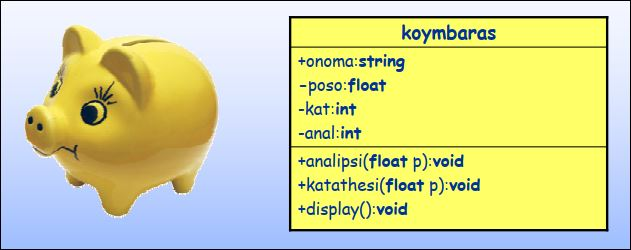

# Εργαστήριο 7

Το περιεχόμενο του 7ου εργαστηρίου είναι το εξής:

- Υπερφόρτωση µεθόδων δόµησης
- Υπερφόρτωση τελεστών

## Άσκηση 7.1 - Κλάση κουµπαράς - ∆ιάγραµµα κλάσεων UML

Αντικείµενο του σηµερινού προγράµµατος είναι η τροποποίηση της κλάσης koymbaras που βρίσκεται στο αρχείο Lab7_1.cpp το οποίο περιέχεται στον φάκελο kodikas7.zip που θα βρείτε στο moodle!. Το παρακάτω διάγραµµα κλάσης της UML δείχνει τη δοµή της κλάσης.



```c++
#include <iostream>
using namespace std;

class koymbaras
{
    private:
        float poso;
        int kat;
        int anal;
    public:
        string onoma;
        koymbaras();
        void analipsi(float p);
        void katathesi(float p);
        void display();
};

koymbaras::koymbaras()
{
    poso = 0;
    kat = 0;
    anal = 0;
}

void koymbaras::katathesi(float p)
{
     poso += p;
     kat++;
     cout << "Molis katathesate " << p << " euro ston " << onoma << endl;
}

void koymbaras::analipsi(float p)
{
    if (p > poso)
    {
        cout << "Sorry den yparxei toso poso gia analipsi" << endl;
        return;
    }
    poso -= p;
    anal++;
    cout << "Molis kanate analipsi " << p << " euro apo ton " << onoma << endl;
}

void koymbaras::display()
{
    cout << endl << "Koymparas: " << onoma << endl;
    cout << "==============================" << endl;
    cout << "Ypoloipo poso: " << poso << endl;
    cout << "Plithos katattheseon: " << kat << endl;
    cout << "Plithos analipseon: " << anal << endl;
    cout << "==============================" << endl;
}


int main()
{
    return 0;
}
```

## Άσκηση 7.1 - Τροποποίηση της κλάσης koymbaras

Αντικείµενο του σηµερινού προγράµµατος είναι η τροποποίηση της κλάσης koymbaras που βρίσκεται στο αρχείο που σας δόθηκε.!

Η κλάση έχει τις ακόλουθες µεταβλητές-µέλη:

- **onoma**: Προσδιορίζει το όνοµα του κουµπαρά (π.χ. "Γουρουνάκι")
- **poso**: Προσδιορίζει το ποσό που περιέχει ο κουµπαράς
- **anal**: Προσδιορίζει το πλήθος των αναλήψεων που κάναµε από τον κουµπαρά
- **kat**: Προσδιορίζει το πλήθος των καταθέσεων που κάναµε στον κουµπαρά

και τις ακόλουθες µεθόδους:

- **analipsi(float p)**: Κάνει ανάληψη από τον κουµπαρά το ποσό της παραµέτρου p
- **katathesi(float p)**: Κάνει κατάθεση στον κουµπαρά το ποσό της παραµέτρου p
- **display()**: Eµφανίζει τα στοιχεία του κουµπαρά

### Βήμα 1

Κατεβάστε το αρχείο **kodikas7.zip** και αντιγράψτε όλα τα αρχεία που περιέχει στο φάκελο "My documents". Το αρχείο **Lab7_1.cpp** περιέχει τη κλάση **koymbaras** την οποία πρέπει να τροποποιήσουµε. Ανοίξτε το µε το περιβάλλον του DEV C++. Μελετήστε τη κλάση **koymbaras**, και τις µεθόδους της. Ακόλουθα, στη συνάρτηση **main()**. ∆ηµιουργήστε δύο αντικείµενα κουµπαράδες **k1** & **k2**. Το όνοµα του κουµπαρά k1 να είναι "Goyroynaki" και του k2 "Metalikos". Κάντε καταθέσεις 100, 200 και 50€ στον k1, και 30 και 5€ στον k2. Κάντε αναλήψεις 80 και 30€ από τον k1 και µία ανάληψη 8€ από τον k2. Εµφανίστε τα στοιχεία και των δύο κουµπαράδων.

```c++
#include <iostream>
using namespace std;

class koymbaras
{
    private:
        float poso;
        int kat;
        int anal;
    public:
        string onoma;
        koymbaras();
        void analipsi(float p);
        void katathesi(float p);
        void display();
};

koymbaras::koymbaras()
{
    poso = 0;
    kat = 0;
    anal = 0;
}

void koymbaras::katathesi(float p)
{
     poso += p;
     kat++;
     cout << "Molis katathesate " << p << " euro ston " << onoma << endl;
}

void koymbaras::analipsi(float p)
{
    if (p > poso)
    {
        cout << "Sorry den yparxei toso poso gia analipsi" << endl;
        return;
    }
    poso -= p;
    anal++;
    cout << "Molis kanate analipsi " << p << " euro apo ton " << onoma << endl;
}

void koymbaras::display()
{
    cout << endl << "Koymparas: " << onoma << endl;
    cout << "==============================" << endl;
    cout << "Ypoloipo poso: " << poso << endl;
    cout << "Plithos katattheseon: " << kat << endl;
    cout << "Plithos analipseon: " << anal << endl;
    cout << "==============================" << endl;
}


int main()
{
    koymbaras k1, k2;

    /* k1 */
    k1.onoma = "Goyroynaki";
    k1.katathesi(100);
    k1.katathesi(200);
    k1.katathesi(50);
    k1.analipsi(80);
    k1.analipsi(30);
    k1.display();

    /* k2 */
    k2.onoma = "Metalikos";
    k2.katathesi(30);
    k2.katathesi(5);
    k2.analipsi(8);
    k2.display();

    return 0;
}
```

### Βήμα 2

Η κλάση διαθέτει µια µέθοδο δόµησης. Τώρα θα πρέπει να υπερφορτώσουµε τη µέθοδο δόµησης ακόµα δύο φορές:
- **Με µία παράµετρο τύπου float**.

_Αυτή η έκδοση της µεθόδου δόµησης θα καταχωρίζει τη τιµή της παραµέτρου ως αρχικό ποσό του κουµπαρά. Η µέθοδος να καταχωρεί επίσης την τιµή 0 στις µεταβλητές-µέλη kat και anal._

- **Με µία παράµετρο τύπου float και µια κλάσης string.**

_Αυτή η έκδοση της µεθόδου δόµησης θα καταχωρίζει τη τιµή της πρώτης παραµέτρου ως αρχικό ποσό του κουµπαρά και της δεύτερης ως το όνοµά του. Η µέθοδος να καταχωρεί επίσης την 
τιµή 0 στις µεταβλητές-µέλη kat και anal._

Μέσα στη συνάρτηση main(), δηµιουργήστε δύο νέους κουµπαράδες **k3** και **k4**. Στον πρώτο να καταχωριστεί αρχικό ποσό 100€, και στον δεύτερο ποσό 300€ και όνοµα το όνοµά σας. **Η δήλωση των αντικειµένων-κουµπαράδων να γίνει** µε τέτοιο τρόπο ώστε να καλούνται αντίστοιχα οι δύο παραπάνω εκδόσεις της υπερφορτωµένης µεθόδου δόµησης. Αµέσως µετά εµφανίστε τα στοιχεία των δύο κουµπαράδων. ∆ούλεψαν οι υπερφορτωµένες εκδόσεις της µεθόδου δόµησης?

```c++
#include <iostream>
using namespace std;

class koymbaras
{
    private:
        float poso;
        int kat;
        int anal;
    public:
        string onoma;
        koymbaras();
        koymbaras(float arxiko_poso);
        koymbaras(float arxiko_poso, string name);
        void analipsi(float p);
        void katathesi(float p);
        void display();
};

koymbaras::koymbaras()
{
    poso = 0;
    kat = 0;
    anal = 0;
}

koymbaras::koymbaras(float arxiko_poso)
{
    poso = arxiko_poso;
    kat = 0;
    anal = 0;
}

koymbaras::koymbaras(float arxiko_poso, string name)
{
    poso = arxiko_poso;
    onoma = name;
    kat = 0;
    anal = 0;
}

void koymbaras::katathesi(float p)
{
    poso += p;
    kat++;
    cout << "Molis katathesate " << p << " euro ston " << onoma << endl;
}

void koymbaras::analipsi(float p)
{
    if (p > poso)
    {
        cout << "Sorry den yparxei toso poso gia analipsi" << endl;
        return;
    }
    poso -= p;
    anal++;
    cout << "Molis kanate analipsi " << p << " euro apo ton " << onoma << endl;
}

void koymbaras::display()
{
     cout << endl << "Koymparas: " << onoma << endl;
     cout << "==============================" << endl;
     cout << "Ypoloipo poso: " << poso << endl;
     cout << "Plithos katattheseon: " << kat << endl;
     cout << "Plithos analipseon: " << anal << endl;
     cout << "==============================" << endl;
}


int main()
{
    koymbaras k1, k2;

    /* k1 */
    k1.onoma = "Goyroynaki";
    k1.katathesi(100);
    k1.katathesi(200);
    k1.katathesi(50);
    k1.analipsi(80);
    k1.analipsi(30);
    k1.display();

    /* k2 */
    k2.onoma = "Metalikos";
    k2.katathesi(30);
    k2.katathesi(5);
    k2.analipsi(8);
    k2.display();

    /* k3 */
    koymbaras k3(100);
    k3.display();

    /* k4 */
    koymbaras k4(300, "Efstratia");
    k4.display();

    return 0;
}
```

### Βήμα 3

Θα υπερφορτώσουµε τον τελεστή `+` για τη κλάση **koymbaras** ώστε όταν προσθέτουµε δύο αντικείµενα-κουµπαράδες να προκύπτει ένα νέο αντικείµενο κουµπαράς µε ποσό το άθροισµα των αντίστοιχων ποσών των δύο κουµπαράδων. Επίσης ο νέος κουµπαράς θα πρέπει να διαθέτει το άθροισµα του πλήθους αναλήψεων και καταθέσεων των δύο κουµπαράδων που προστίθενται. Το όνοµα του νέου κουµπαρά να είναι "Neos". Μόλις υπερφορτώσετε τον τελεστή `+`, δηµιουργήστε έναν νέο κουµπαρά **k5** στον οποίο να καταχωρήστε το άθροισµα των **k1** και **k2**. Εµφανίστε τα στοιχεία του **k5**.

```c++
#include <iostream>
using namespace std;

class koymbaras
{
    private:
        float poso;
        int kat;
        int anal;
    public:
        string onoma;
        koymbaras();
        koymbaras(float arxiko_poso);
        koymbaras(float arxiko_poso, string name);
        void analipsi(float p);
        void katathesi(float p);
        void display();
        koymbaras operator+(koymbaras right);
};

koymbaras koymbaras::operator+(koymbaras right)
{
    koymbaras new_koymbaras;
    new_koymbaras.poso = poso + right.poso;
    new_koymbaras.anal = anal + right.anal;
    new_koymbaras.kat = kat + right.kat;
    new_koymbaras.onoma = "Neos";
    return new_koymbaras;
}

koymbaras::koymbaras()
{
    poso = 0;
    kat = 0;
    anal = 0;
}

koymbaras::koymbaras(float arxiko_poso)
{
    poso = arxiko_poso;
    kat = 0;
    anal = 0;
}

koymbaras::koymbaras(float arxiko_poso, string name)
{
    poso = arxiko_poso;
    onoma = name;
    kat = 0;
    anal = 0;
}

void koymbaras::katathesi(float p)
{
    poso += p;
    kat++;
    cout << "Molis katathesate " << p << " euro ston " << onoma << endl;
}

void koymbaras::analipsi(float p)
{
    if (p > poso)
    {
        cout << "Sorry den yparxei toso poso gia analipsi" << endl;
        return;
    }
    poso -= p;
    anal++;
    cout << "Molis kanate analipsi " << p << " euro apo ton " << onoma << endl;
}

void koymbaras::display()
{
    cout << endl << "Koymparas: " << onoma << endl;
    cout << "==============================" << endl;
    cout << "Ypoloipo poso: " << poso << endl;
    cout << "Plithos katattheseon: " << kat << endl;
    cout << "Plithos analipseon: " << anal << endl;
    cout << "==============================" << endl;
}


int main()
{
    koymbaras k1, k2;

    /* k1 */
    k1.onoma = "Goyroynaki";
    k1.katathesi(100);
    k1.katathesi(200);
    k1.katathesi(50);
    k1.analipsi(80);
    k1.analipsi(30);
    k1.display();

    /* k2 */
    k2.onoma = "Metalikos";
    k2.katathesi(30);
    k2.katathesi(5);
    k2.analipsi(8);
    k2.display();

    /* k3 */
    koymbaras k3(100);
    k3.display();

    /* k4 */
    koymbaras k4(300, "Efstratia");
    k4.display();

    /* k5 */
    koymbaras k5 = k1 + k2;
    k5.display();

    return 0;
}
```

### Βήμα 4

Αποφασίσαµε ότι οι κουµπαράδες θα συγκρίνονται (για το αν είναι ίσοι) µε το ποσό που διαθέτουν. Υπερφορτώστε τον τελεστή `==` για τη κλάση koymbaras ώστε όταν συγκρίνουµε δύο αντικείµενα-κουµπαράδες να είναι ίσα όταν διαθέτουν ίδιο ποσό χρηµάτων. Μόλις υπερφορτώσετε τον τελεστή `==`, συγκρίνετε τους κουµπαράδες **k3** και **k4** και εµφανίστε το κατάλληλο µήνυµα για το αν είναι ίσο.

```c++
#include <iostream>
using namespace std;

class koymbaras
{
    private:
        float poso;
        int kat;
        int anal;
    public:
        string onoma;
        koymbaras();
        koymbaras(float arxiko_poso);
        koymbaras(float arxiko_poso, string name);
        void analipsi(float p);
        void katathesi(float p);
        void display();
        koymbaras operator+(koymbaras right);
        bool operator==(koymbaras right);
};

koymbaras koymbaras::operator+(koymbaras right)
{
    koymbaras new_koymbaras;
    new_koymbaras.poso = poso + right.poso;
    new_koymbaras.anal = anal + right.anal;
    new_koymbaras.kat = kat + right.kat;
    new_koymbaras.onoma = "Neos";
    return new_koymbaras;
}

bool koymbaras::operator==(koymbaras right)
{
    if(poso == right.poso)
    {
        return true;
    }
    else
    {
        return false;
    }
}

koymbaras::koymbaras()
{
    poso = 0;
    kat = 0;
    anal = 0;
}

koymbaras::koymbaras(float arxiko_poso)
{
    poso = arxiko_poso;
    kat = 0;
    anal = 0;
}

koymbaras::koymbaras(float arxiko_poso, string name)
{
    poso = arxiko_poso;
    onoma = name;
    kat = 0;
    anal = 0;
}

void koymbaras::katathesi(float p)
{
    poso += p;
    kat++;
    cout << "Molis katathesate " << p << " euro ston " << onoma << endl;
}

void koymbaras::analipsi(float p)
{
    if (p > poso)
    {
        cout << "Sorry den yparxei toso poso gia analipsi" << endl;
        return;
    }
    poso -= p;
    anal++;
    cout << "Molis kanate analipsi " << p << " euro apo ton " << onoma << endl;
}

void koymbaras::display()
{
    cout << endl << "Koymparas: " << onoma << endl;
    cout << "==============================" << endl;
    cout << "Ypoloipo poso: " << poso << endl;
    cout << "Plithos katattheseon: " << kat << endl;
    cout << "Plithos analipseon: " << anal << endl;
    cout << "==============================" << endl;
}


int main()
{
    koymbaras k1, k2;

    /* k1 */
    k1.onoma = "Goyroynaki";
    k1.katathesi(100);
    k1.katathesi(200);
    k1.katathesi(50);
    k1.analipsi(80);
    k1.analipsi(30);
    k1.display();

    /* k2 */
    k2.onoma = "Metalikos";
    k2.katathesi(30);
    k2.katathesi(5);
    k2.analipsi(8);
    k2.display();

    /* k3 */
    koymbaras k3(100);
    k3.display();

    /* k4 */
    koymbaras k4(300, "Efstratia");
    k4.display();

    /* k5 */
    koymbaras k5 = k1 + k2;
    k5.display();

    if(k3 == k4)
    {
        cout << "Oi koymbarades einai isoi." << endl;
    }
    else
    {
        cout << "Oi koymbarades den einai isoi." << endl;
    }

    return 0;
}
```

### Βήμα 5

Θα υπερφορτώσουµε τον τελεστή εισαγωγής `<<` για τη κλάση **koymbaras** ώστε όταν ακολουθείται από ένα ποσό (float) να κάνει **κατάθεση** αυτού του ποσού στον κουµπαρά, και τον τελεστή εξαγωγής `>>` ώστε όταν ακολουθείται από ένα ποσό να κάνει **ανάληψη** του ποσού από τον κουµπαρά. Μόλις υπερφορτώσετε τους δύο τελεστές, χρησιµοποιήστε τους ώστε να καταθέσετε 50€ στον k2 και να κάνετε ανάληψη 10€ από τον k1.

```c++
#include <iostream>
using namespace std;

class koymbaras
{
    private:
        float poso;
        int kat;
        int anal;
    public:
        string onoma;
        koymbaras();
        koymbaras(float arxiko_poso);
        koymbaras(float arxiko_poso, string name);
        void analipsi(float p);
        void katathesi(float p);
        void display();
        koymbaras operator+(koymbaras right);
        bool operator==(koymbaras right);
        void operator<<(float right);
        void operator>>(float right);
};

koymbaras koymbaras::operator+(koymbaras right)
{
    koymbaras new_koymbaras;
    new_koymbaras.poso = poso + right.poso;
    new_koymbaras.anal = anal + right.anal;
    new_koymbaras.kat = kat + right.kat;
    new_koymbaras.onoma = "Neos";
    return new_koymbaras;
}

bool koymbaras::operator==(koymbaras right)
{
    if(poso == right.poso)
    {
        return true;
    }
    else
    {
        return false;
    }
}

void koymbaras::operator<<(float right)
{
    katathesi(right);
}

void koymbaras::operator>>(float right)
{
    analipsi(right);
}

koymbaras::koymbaras()
{
    poso = 0;
    kat = 0;
    anal = 0;
}

koymbaras::koymbaras(float arxiko_poso)
{
    poso = arxiko_poso;
    kat = 0;
    anal = 0;
}

koymbaras::koymbaras(float arxiko_poso, string name)
{
    poso = arxiko_poso;
    onoma = name;
    kat = 0;
    anal = 0;
}

void koymbaras::katathesi(float p)
{
    poso += p;
    kat++;
    cout << "Molis katathesate " << p << " euro ston " << onoma << endl;
}

void koymbaras::analipsi(float p)
{
    if (p > poso)
    {
        cout << "Sorry den yparxei toso poso gia analipsi" << endl;
        return;
    }
    poso -= p;
    anal++;
    cout << "Molis kanate analipsi " << p << " euro apo ton " << onoma << endl;
}

void koymbaras::display()
{
    cout << endl << "Koymparas: " << onoma << endl;
    cout << "==============================" << endl;
    cout << "Ypoloipo poso: " << poso << endl;
    cout << "Plithos katattheseon: " << kat << endl;
    cout << "Plithos analipseon: " << anal << endl;
    cout << "==============================" << endl;
}


int main()
{
    koymbaras k1, k2;

    /* k1 */
    k1.onoma = "Goyroynaki";
    k1.katathesi(100);
    k1.katathesi(200);
    k1.katathesi(50);
    k1.analipsi(80);
    k1.analipsi(30);
    k1.display();

    /* k2 */
    k2.onoma = "Metalikos";
    k2.katathesi(30);
    k2.katathesi(5);
    k2.analipsi(8);
    k2.display();

    /* k3 */
    koymbaras k3(100);
    k3.display();

    /* k4 */
    koymbaras k4(300, "Efstratia");
    k4.display();

    /* k5 */
    koymbaras k5 = k1 + k2;
    k5.display();

    if(k3 == k4)
    {
        cout << "Oi koymbarades einai isoi." << endl;
    }
    else
    {
        cout << "Oi koymbarades den einai isoi." << endl;
    }

    k2 << 50;
    k1 >> 10;

    return 0;
}
```

### Βήμα 6

Θέλουµε για κάθε κουµπαρά να κρατάµε το ιστορικό καταθέσεων και αναλήψεων του. Πρέπει να τροποποιήστε τη κλάση ώστε αυτό να είναι δυνατόν. Μια νέα µέθοδος **history()** θα πρέπει να εµφανίζει το ιστορικό του κάθε κουµπαρά. Θεωρήστε ότι θα κρατάµε συνολικά το πολύ 20 καταθέσεις και αναλήψεις. Οι αναλήψεις να εµφανίζονται µε αρνητικό πρόσηµο. Στη main() εµφανίστε το ιστορικό των κουµπαράδων k1 και k2! Σκεφτείτε τι θα πρέπει να προσθέσετε στις µεταβλητές-µέλη καθώς και πως θα τροποποιήστε τις υπάρχουσες µεθόδους. Καλό κουράγιο! Τέλος εµφανίστε το ιστορικό του k5! Αν κάτι δεν πάει καλά σκεφτείτε τι πρέπει να κάνετε

```c++
#include <iostream>
using namespace std;

class koymbaras
{
    private:
        float poso;
        int kat;
        int anal;
        int cntr;
        float istoriko[20];
    public:
        string onoma;
        koymbaras();
        koymbaras(float arxiko_poso);
        koymbaras(float arxiko_poso, string name);
        void analipsi(float p);
        void katathesi(float p);
        void display();
        void history();
        koymbaras operator+(koymbaras right);
        bool operator==(koymbaras right);
        void operator<<(float right);
        void operator>>(float right);
};

koymbaras koymbaras::operator+(koymbaras right)
{
    koymbaras new_koymbaras;
    new_koymbaras.poso = poso + right.poso;
    new_koymbaras.anal = anal + right.anal;
    new_koymbaras.kat = kat + right.kat;
    new_koymbaras.onoma = "Neos";
    return new_koymbaras;
}

bool koymbaras::operator==(koymbaras right)
{
    if(poso == right.poso)
    {
        return true;
    }
    else
    {
        return false;
    }
}

void koymbaras::operator<<(float right)
{
    katathesi(right);
}

void koymbaras::operator>>(float right)
{
    analipsi(right);
}

koymbaras::koymbaras()
{
    poso = 0;
    kat = 0;
    anal = 0;
    cntr = 0;
}

koymbaras::koymbaras(float arxiko_poso)
{
    poso = arxiko_poso;
    kat = 0;
    anal = 0;
    cntr = 0;
}

koymbaras::koymbaras(float arxiko_poso, string name)
{
    poso = arxiko_poso;
    onoma = name;
    kat = 0;
    anal = 0;
    cntr = 0;
}

void koymbaras::katathesi(float p)
{
    poso += p;
    kat++;
    istoriko[cntr] = p;
    cntr++;
    cout << "Molis katathesate " << p << " euro ston " << onoma << endl;
}

void koymbaras::analipsi(float p)
{
    if (p > poso)
    {
        cout << "Sorry den yparxei toso poso gia analipsi" << endl;
        return;
    }
    poso -= p;
    anal++;
    istoriko[cntr] = -p;
    cntr++;
    cout << "Molis kanate analipsi " << p << " euro apo ton " << onoma << endl;
}

void koymbaras::display()
{
    cout << endl << "Koymparas: " << onoma << endl;
    cout << "==============================" << endl;
    cout << "Ypoloipo poso: " << poso << endl;
    cout << "Plithos katattheseon: " << kat << endl;
    cout << "Plithos analipseon: " << anal << endl;
    cout << "==============================" << endl;
}

void koymbaras::history()
{
    int i;
    cout << "History: " << onoma << endl;
    for(i = 0; i < cntr; i++)
    {
        cout << istoriko[i] << endl;
    }
}

int main()
{
    koymbaras k1, k2;

    /* k1 */
    k1.onoma = "Goyroynaki";
    k1.katathesi(100);
    k1.katathesi(200);
    k1.katathesi(50);
    k1.analipsi(80);
    k1.analipsi(30);
    k1.display();

    /* k2 */
    k2.onoma = "Metalikos";
    k2.katathesi(30);
    k2.katathesi(5);
    k2.analipsi(8);
    k2.display();

    /* k3 */
    koymbaras k3(100);
    k3.display();

    /* k4 */
    koymbaras k4(300, "Efstratia");
    k4.display();

    /* k5 */
    koymbaras k5 = k1 + k2;
    k5.display();

    if(k3 == k4)
    {
        cout << "Oi koymbarades einai isoi." << endl;
    }
    else
    {
        cout << "Oi koymbarades den einai isoi." << endl;
    }

    k2 << 50;
    k1 >> 10;

    k1.history();
    k2.history();
    k5.history();

    return 0;
}
```
