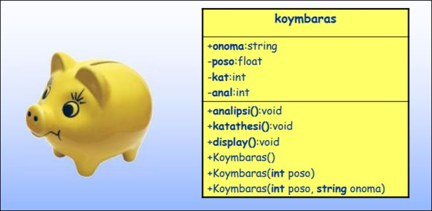

# Εργαστήριο 8

Το περιεχόμενο του 8ου εργαστηρίου είναι το εξής:

- Στατικά µέλη κλάσης
- Μορφοποιηµένη έξοδος µε το aντικείµενο cout

## Άσκηση 8.1 - Κλάση κουµπαράς - Διάγραµµα κλάσεων UML

Αντικείµενο του σηµερινού προγράµµατος είναι η τροποποίηση της κλάσης **koymbaras** που βρίσκεται στο αρχείο **Lab8_1.cpp** το οποίο περιέχεται στον φάκελο **kodikas8.zip** που θα βρείτε στο moodle!. Το παρακάτω διάγραµµα κλάσης της UML δείχνει τη δοµή της κλάσης.



```c++
#include <iostream>
#include <cstdlib>

using namespace std;

class koymbaras
{
    private:
        float poso;
        int kat;
        int anal;
    public:
        string onoma;
        koymbaras();
        koymbaras(float p);
        koymbaras(float p, string o);
        void analipsi(float p);
        void katathesi(float p);
        void display();
};

koymbaras::koymbaras()
{
    poso = 0;
    kat = 0;
    anal = 0;
}

koymbaras::koymbaras(float p)
{
    poso = p;
    kat = 0;
    anal = 0;
}

koymbaras::koymbaras(float p, string o)
{
    poso = p;
    onoma = o;
    kat = 0;
    anal = 0;
}

void koymbaras::katathesi(float p)
{
    poso += p;
    kat++;
    cout << "Molis katathesate " << p << " euro ston " << onoma <<endl;
}

void koymbaras::analipsi(float p)
{
    if (p > poso)
    {
        cout << "Sorry den yparxei toso poso gia analipsi" << endl;
        return;
    }
    poso -= p;
    anal++;
    cout << "Molis kanate analipsi " <<p <<" euro apo ton "<< onoma << endl;
}

void koymbaras::display()
{
    cout << endl << "Koymparas: "<< onoma << endl;
    cout << "==============================" << endl;
    cout << "Ypoloipo poso: "<< poso << endl;
    cout << "Plithos katattheseon: " << kat << endl;
    cout << "Plithos analipseon: " << anal << endl;
    cout << "==============================" << endl;
}


int main()
{


    return 0;
}
```

## Άσκηση 8.1 - Τροποποίηση της κλάσης koymbaras

Αντικείµενο του σηµερινού προγράµµατος είναι η τροποποίηση της κλάσης koymbaras που βρίσκεται στο αρχείο που σας δόθηκε.!

Η κλάση έχει τις ακόλουθες µεταβλητές-µέλη:

- **onoma**: Προσδιορίζει το όνοµα του κουµπαρά (π.χ. "Γουρουνάκι")
- **poso**: Προσδιορίζει το ποσό που περιέχει ο κουµπαράς
- **anal**: Προσδιορίζει το πλήθος των αναλήψεων που κάναµε από τον κουµπαρά
- **kat**: Προσδιορίζει το πλήθος των καταθέσεων που κάναµε στον κουµπαρά

και τις ακόλουθες µεθόδους:

- **analipsi(float poso)**: Κάνει ανάληψη από τον κουµπαρά το ποσό της παραµέτρου
- **katathesi(float poso)**: Κάνει κατάθεση στον κουµπαρά το ποσό της παραµέτρου
- **display()**: Eµφανίζει τα στοιχεία του κουµπαρά

H κλάση διαθέτει επίσης και τρεις µεθόδους **δόµησης**

### Βήμα 1

Κατεβάστε το αρχείο **kodikas8.zip** και αντιγράψτε όλα τα αρχεία που περιέχει στο φάκελο "My documents". Το αρχείο **Lab8_1.cpp** περιέχει τη κλάση **koymbaras** την οποία πρέπει να τροποποιήσουµε. Ανοίξτε το µε το περιβάλλον του DEV C++. Μελετήστε τη κλάση **koymbaras**, και τις µεθόδους της.

### Βήμα 2

Θέλουµε να κρατάµε συνολικά το πλήθος των κουµπαράδων που δηµιουργούνται στη κλάση **koymbaras**. Για αυτό το σκοπό δηµιουργήστε µία νέα µεταβλητή-µέλος της κλάσης την οποία να 'µοιράζονται' όλα τα αντικείµενα της κλάσης. Ονοµάστε τη µεταβλητή-µέλος **plithos** και σκεφτείτε τι ιδιαιτερότητα πρέπει να έχει. Τροποποιήστε κατάλληλα τις µεθόδους δόµησης ώστε κάθε φορά που δηµιουργείται ένας νέος κουµπαράς να αυξάνει τη µεταβλητή **plithos** κατά 1.

```c++
#include <iostream>
#include <cstdlib>

using namespace std;

class koymbaras
{
    private:
        float poso;
        int kat;
        int anal;
    public:
        string onoma;
        koymbaras();
        koymbaras(float p);
        koymbaras(float p, string o);
        void analipsi(float p);
        void katathesi(float p);
        void display();
        static int plithos;
};

int koymbaras::plithos = 0;

koymbaras::koymbaras()
{
    poso = 0;
    kat = 0;
    anal = 0;
    plithos++;
}

koymbaras::koymbaras(float p)
{
    poso = p;
    kat = 0;
    anal = 0;
    plithos++;
}

koymbaras::koymbaras(float p, string o)
{
    poso = p;
    onoma = o;
    kat = 0;
    anal = 0;
    plithos++;
}

void koymbaras::katathesi(float p)
{
    poso += p;
    kat++;
    cout << "Molis katathesate " << p << " euro ston " << onoma << endl;
}

void koymbaras::analipsi(float p)
{
    if (p > poso)
    {
        cout << "Sorry den yparxei toso poso gia analipsi" << endl;
        return;
    }
    poso -= p;
    anal++;
    cout << "Molis kanate analipsi " <<p <<" euro apo ton "<< onoma << endl;
}

void koymbaras::display()
{
    cout << endl << "Koymparas: "<< onoma << endl;
    cout << "=============================="<< endl;
    cout << "Ypoloipo poso: " << poso << endl;
    cout << "Plithos katattheseon: " << kat << endl;
    cout << "Plithos analipseon: "<< anal << endl;
    cout << "==============================" << endl;
}


int main()
{


    return 0;
}
```

### Βήμα 3

Μέσα στη συνάρτηση **main()**, δηµιουργήστε δύο νέους κουµπαράδες **k1** και **k2**. Στον πρώτο να καταχωριστεί αρχικό ποσό 100€, και στον δεύτερο ποσό 300€ και όνοµα το όνοµά σας. Η δήλωση των αντικειµένων-κουµπαράδων να γίνει µε τέτοιο τρόπο ώστε να καλούνται αντίστοιχα οι κατάλληλες εκδόσεις της υπερφορτωµένης µεθόδου δόµησης. Αµέσως µετά εµφανίστε τα στοιχεία των δύο κουµπαράδων

```c++
#include <iostream>
#include <cstdlib>

using namespace std;

class koymbaras
{
    private:
        float poso;
        int kat;
        int anal;
    public:
        string onoma;
        koymbaras();
        koymbaras(float p);
        koymbaras(float p, string o);
        void analipsi(float p);
        void katathesi(float p);
        void display();
        static int plithos;
};

int koymbaras::plithos = 0;

koymbaras::koymbaras()
{
    poso = 0;
    kat = 0;
    anal = 0;
    plithos++;
}

koymbaras::koymbaras(float p)
{
    poso = p;
    kat = 0;
    anal = 0;
    plithos++;
}

koymbaras::koymbaras(float p, string o)
{
    poso = p;
    onoma = o;
    kat = 0;
    anal = 0;
    plithos++;
}

void koymbaras::katathesi(float p)
{
    poso += p;
    kat++;
    cout << "Molis katathesate " << p << " euro ston "<< onoma << endl;
}

void koymbaras::analipsi(float p)
{
    if (p > poso)
    {
        cout<<"Sorry den yparxei toso poso gia analipsi"<<endl;
        return;
    }
    poso -= p;
    anal++;
    cout << "Molis kanate analipsi " <<p << " euro apo ton " << onoma << endl;
}

void koymbaras::display()
{
    cout << endl << "Koymparas: " << onoma << endl;
    cout << "==============================" << endl;
    cout << "Ypoloipo poso: "<< poso << endl;
    cout << "Plithos katattheseon: "<< kat << endl;
    cout << "Plithos analipseon: "<< anal << endl;
    cout << "==============================" << endl;
}


int main()
{
    /* k1 */
    koymbaras k1(100);
    k1.display();

    /* k2 */
    koymbaras k2(300, "Efstratia");
    k2.display();

    return 0;
}
```

### Βήμα 4

Στη συνέχεια του κώδικα στη συνάρτηση **main()** εµφανίστε το πλήθος των κουµπαράδων που έχουν δηµιουργηθεί (δηλαδή το περιεχόµενο της µεταβλητής-µέλος **plithos**). Αµέσως µετά δηµιουργήστε έναν νέο κουµπαρά µε όνοµα **k3** και εµφανίστε πάλι τη τιµή της µεταβλητής-µέλος **plithos**! αλλά µε διαφορετικό τρόπο από ότι το κάνατε πριν.

```c++
#include <iostream>
#include <cstdlib>

using namespace std;

class koymbaras
{
    private:
        float poso;
        int kat;
        int anal;
    public:
        string onoma;
        koymbaras();
        koymbaras(float p);
        koymbaras(float p, string o);
        void analipsi(float p);
        void katathesi(float p);
        void display();
        static int plithos;
};

int koymbaras::plithos = 0;

koymbaras::koymbaras()
{
    poso = 0;
    kat = 0;
    anal = 0;
    plithos++;
}

koymbaras::koymbaras(float p)
{
    poso = p;
    kat = 0;
    anal = 0;
    plithos++;
}

koymbaras::koymbaras(float p, string o)
{
    poso = p;
    onoma = o;
    kat = 0;
    anal = 0;
    plithos++;
}

void koymbaras::katathesi(float p)
{
    poso += p;
    kat++;
    cout << "Molis katathesate " << p << " euro ston " << onoma << endl;
}

void koymbaras::analipsi(float p)
{
    if (p > poso)
    {
        cout << "Sorry den yparxei toso poso gia analipsi" << endl;
        return;
    }
    poso -= p;
    anal++;
    cout << "Molis kanate analipsi " << p << " euro apo ton " << onoma << endl;
}

void koymbaras::display()
{
    cout <<  endl <<"Koymparas: " << onoma << endl;
    cout << "==============================" << endl;
    cout << "Ypoloipo poso: " << poso << endl;
    cout << "Plithos katattheseon: " << kat << endl;
    cout << "Plithos analipseon: " << anal << endl;
    cout << "==============================" << endl;
}


int main()
{
    /* k1 */
    koymbaras k1(100);
    k1.display();

    /* k2 */
    koymbaras k2(300, "Efstratia");
    k2.display();

    cout << "Plithos mesw static: " << koymbaras::plithos << endl;

    /* k3 */
    koymbaras k3;

    cout << "Plithos mesw k3: " << k3.plithos << endl;

    return 0;
}
```

### Βήμα 5

Θέλουµε να κρατάµε το ποσό που περιέχουν συνολικά όλοι οι κουµπαράδες της κλάσης. Για αυτό το σκοπό δηµιουργήστε µία κατάλληλη µεταβλητή-µέλος της κλάσης. Ονοµάστε τη µεταβλητή-µέλος **synolo**. Τροποποιήστε κατάλληλα τις µεθόδους δόµησης ώστε κάθε φορά που δηµιουργείται ένας νέος κουµπαράς να προστίθεται στο **synolo** το ποσό που περιέχει.

```c++
#include <iostream>
#include <cstdlib>

using namespace std;

class koymbaras
{
    private:
        float poso;
        int kat;
        int anal;
    public:
        string onoma;
        koymbaras();
        koymbaras(float p);
        koymbaras(float p, string o);
        void analipsi(float p);
        void katathesi(float p);
        void display();
        static int plithos;
        static float synolo;
};

int koymbaras::plithos = 0;
float koymbaras::synolo = 0;

koymbaras::koymbaras()
{
    poso = 0;
    kat = 0;
    anal = 0;
    plithos++;
}

koymbaras::koymbaras(float p)
{
    poso = p;
    kat = 0;
    anal = 0;
    plithos++;
    synolo += p;
}

koymbaras::koymbaras(float p, string o)
{
    poso = p;
    onoma = o;
    kat = 0;
    anal = 0;
    plithos++;
    synolo += p;
}

void koymbaras::katathesi(float p)
{
    poso += p;
    kat++;
    cout << "Molis katathesate " << p << " euro ston " << onoma << endl;
}

void koymbaras::analipsi(float p)
{
    if (p > poso)
    {
        cout << "Sorry den yparxei toso poso gia analipsi" << endl;
        return;
    }
    poso -= p;
    anal++;
    cout << "Molis kanate analipsi " << p << " euro apo ton " << onoma << endl;
}

void koymbaras::display()
{
    cout << endl << "Koymparas: " << onoma << endl;
    cout << "==============================" << endl;
    cout << "Ypoloipo poso: " << poso << endl;
    cout << "Plithos katattheseon: "<< kat << endl;
    cout << "Plithos analipseon: " << anal << endl;
    cout << "==============================" << endl;
}


int main()
{
    /* k1 */
    koymbaras k1(100);
    k1.display();

    /* k2 */
    koymbaras k2(300, "Efstratia");
    k2.display();

    cout << "Plithos mesw static: " << koymbaras::plithos << endl;

    /* k3 */
    koymbaras k3;

    cout << "Plithos mesw k3: " << k3.plithos << endl;

    return 0;
}
```

### Βήμα 6

Τροποποιήστε κατάλληλα τις µεθόδους **analipsi()** και **katathesi()** ώστε όταν γίνεται κατάθεση ποσού σε οποιονδήποτε κουµπαρά να προστίθεται στο **synolo** και όταν γίνεται ανάληψη ποσού από οποιονδήποτε κουµπαρά να αφαιρείται.

```c++
#include <iostream>
#include <cstdlib>

using namespace std;

class koymbaras
{
    private:
        float poso;
        int kat;
        int anal;
    public:
        string onoma;
        koymbaras();
        koymbaras(float p);
        koymbaras(float p, string o);
        void analipsi(float p);
        void katathesi(float p);
        void display();
        static int plithos;
        static float synolo;
};

int koymbaras::plithos = 0;
float koymbaras::synolo = 0;

koymbaras::koymbaras()
{
    poso = 0;
    kat = 0;
    anal = 0;
    plithos++;
}

koymbaras::koymbaras(float p)
{
    poso = p;
    kat = 0;
    anal = 0;
    plithos++;
    synolo += p;
}

koymbaras::koymbaras(float p, string o)
{
    poso = p;
    onoma = o;
    kat = 0;
    anal = 0;
    plithos++;
    synolo += p;
}

void koymbaras::katathesi(float p)
{
    poso += p;
    kat++;
    cout << "Molis katathesate " << p << " euro ston " << onoma << endl;
    synolo += p;
}

void koymbaras::analipsi(float p)
{
    if (p > poso)
    {
        cout << "Sorry den yparxei toso poso gia analipsi" << endl;
        return;
    }
    poso -= p;
    anal++;
    cout << "Molis kanate analipsi " << p << " euro apo ton " << onoma << endl;
    synolo -= p;
}

void koymbaras::display()
{
    cout << endl << "Koymparas: " << onoma << endl;
    cout << "==============================" << endl;
    cout << "Ypoloipo poso: " << poso << endl;
    cout << "Plithos katattheseon: "<< kat << endl;
    cout << "Plithos analipseon: " << anal << endl;
    cout << "==============================" << endl;
}


int main()
{
    /* k1 */
    koymbaras k1(100);
    k1.display();

    /* k2 */
    koymbaras k2(300, "Efstratia");
    k2.display();

    cout << "Plithos mesw static: " << koymbaras::plithos << endl;

    /* k3 */
    koymbaras k3;

    cout << "Plithos mesw k3: " << k3.plithos << endl;

    return 0;
}
```

### Βήμα 7

Φτιάξτε µια νέα µέθοδο µε όνοµα **all()**. Η µέθοδος θα πρέπει να εµφανίζει το συνολικό πλήθος (plithos) των κουµπαράδων της κλάσης καθώς και το συνολικό ποσό που περιέχουν (synolo), µε τη µορφή που εµφανίζεται στο πλαίσιο. Η τιµή του πλήθους πρέπει να εµφανίζεται σε ένα χώρο 7 θέσεων στην οθόνη µε αριστερή στοίχιση. Η τιµή του συνόλου να εµφανίζεται πάλι σε χώρο 7 θέσεων µε δύο δεκαδικά και δεξιά στοίχιση.

```c++
KOYMPARADES
=================
Plithos : 5
Synolo : 1234.40
```

```c++
#include <iostream>
#include <cstdlib>
#include <iomanip>

using namespace std;

class koymbaras
{
    private:
        float poso;
        int kat;
        int anal;
    public:
        string onoma;
        koymbaras();
        koymbaras(float p);
        koymbaras(float p, string o);
        void analipsi(float p);
        void katathesi(float p);
        void display();
        void all();
        static int plithos;
        static float synolo;
};

int koymbaras::plithos = 0;
float koymbaras::synolo = 0;

koymbaras::koymbaras()
{
    poso = 0;
    kat = 0;
    anal = 0;
    plithos++;
}

koymbaras::koymbaras(float p)
{
    poso = p;
    kat = 0;
    anal = 0;
    plithos++;
    synolo += p;
}

koymbaras::koymbaras(float p, string o)
{
    poso = p;
    onoma = o;
    kat = 0;
    anal = 0;
    plithos++;
    synolo += p;
}

void koymbaras::katathesi(float p)
{
    poso += p;
    kat++;
    cout << "Molis katathesate " << p << " euro ston " << onoma << endl;
    synolo += p;
}

void koymbaras::analipsi(float p)
{
    if (p > poso)
    {
        cout << "Sorry den yparxei toso poso gia analipsi" << endl;
        return;
    }
    poso -= p;
    anal++;
    cout << "Molis kanate analipsi " << p << " euro apo ton " << onoma << endl;
    synolo -= p;
}

void koymbaras::display()
{
    cout << endl << "Koymparas: " << onoma << endl;
    cout << "==============================" << endl;
    cout << "Ypoloipo poso: " << poso << endl;
    cout << "Plithos katattheseon: " << kat << endl;
    cout << "Plithos analipseon: " << anal << endl;
    cout << "==============================" << endl;
}

void koymbaras::all()
{
    cout << "KOYMPARADES" << endl;
    cout << "=================" << endl;
    cout << "Plithos: " << setw(7) << left << plithos << endl;
    cout << "Synolo: " << setw(7) << setprecision(2) << fixed << right << synolo << endl;
}
int main()
{
    /* k1 */
    koymbaras k1(100);
    k1.display();

    /* k2 */
    koymbaras k2(300, "Efstratia");
    k2.display();

    cout << "Plithos mesw static: " << koymbaras::plithos << endl;

    /* k3 */
    koymbaras k3;

    cout << "Plithos mesw k3: " << k3.plithos << endl;

    return 0;
}
```

### Βήμα 8

Κάντε κατάθεση στον **k3** ποσό 300€ και ανάληψη από τον **k2** 50€. Καλέστε τη µέθοδο all() της κλάσης ώστε να εµφανιστούν τα συγκεντρωτικά της στοιχεία.

```c++
#include <iostream>
#include <cstdlib>
#include <iomanip>

using namespace std;

class koymbaras
{
    private:
        float poso;
        int kat;
        int anal;
    public:
        string onoma;
        koymbaras();
        koymbaras(float p);
        koymbaras(float p, string o);
        void analipsi(float p);
        void katathesi(float p);
        void display();
        void all();
        static int plithos;
        static float synolo;
};

int koymbaras::plithos = 0;
float koymbaras::synolo = 0;

koymbaras::koymbaras()
{
    poso = 0;
    kat = 0;
    anal = 0;
    plithos++;
}

koymbaras::koymbaras(float p)
{
    poso = p;
    kat = 0;
    anal = 0;
    plithos++;
    synolo += p;
}

koymbaras::koymbaras(float p, string o)
{
    poso = p;
    onoma = o;
    kat = 0;
    anal = 0;
    plithos++;
    synolo += p;
}

void koymbaras::katathesi(float p)
{
    poso += p;
    kat++;
    cout << "Molis katathesate " << p << " euro ston " << onoma << endl;
    synolo += p;
}

void koymbaras::analipsi(float p)
{
    if (p > poso)
    {
        cout << "Sorry den yparxei toso poso gia analipsi" << endl;
        return;
    }
    poso -= p;
    anal++;
    cout << "Molis kanate analipsi " << p << " euro apo ton " << onoma << endl;
    synolo -= p;
}

void koymbaras::display()
{
    cout << endl << "Koymparas: " << onoma << endl;
    cout << "==============================" << endl;
    cout << "Ypoloipo poso: " << poso << endl;
    cout << "Plithos katattheseon: " << kat << endl;
    cout << "Plithos analipseon: " << anal << endl;
    cout << "==============================" << endl;
}

void koymbaras::all()
{
    cout << "KOYMPARADES" << endl;
    cout << "=================" << endl;
    cout << "Plithos: " << setw(7) << left << plithos << endl;
    cout << "Synolo: " << setw(7) << setprecision(2) << fixed << right << synolo << endl;
}
int main()
{
    /* k1 */
    koymbaras k1(100);
    k1.display();

    /* k2 */
    koymbaras k2(300, "Efstratia");
    k2.display();

    cout << "Plithos mesw static: " << koymbaras::plithos << endl;

    /* k3 */
    koymbaras k3;

    cout << "Plithos mesw k3: " << k3.plithos << endl;

    k3.katathesi(300);
    k2.analipsi(50);
    k2.all();

    return 0;
}
```

### Βήμα 9

Κάντε τις απαραίτητες ενέργειες ώστε η µέθοδος **all()** να µπορεί να κληθεί χωρίς την ύπαρξη αντικειµένων της κλάσης.

```c++
#include <iostream>
#include <cstdlib>
#include <iomanip>

using namespace std;

class koymbaras
{
    private:
        float poso;
        int kat;
        int anal;
    public:
        string onoma;
        koymbaras();
        koymbaras(float p);
        koymbaras(float p, string o);
        void analipsi(float p);
        void katathesi(float p);
        void display();
        static void all();
        static int plithos;
        static float synolo;
};

int koymbaras::plithos = 0;
float koymbaras::synolo = 0;

koymbaras::koymbaras()
{
    poso = 0;
    kat = 0;
    anal = 0;
    plithos++;
}

koymbaras::koymbaras(float p)
{
    poso = p;
    kat = 0;
    anal = 0;
    plithos++;
    synolo += p;
}

koymbaras::koymbaras(float p, string o)
{
    poso = p;
    onoma = o;
    kat = 0;
    anal = 0;
    plithos++;
    synolo += p;
}

void koymbaras::katathesi(float p)
{
    poso += p;
    kat++;
    cout << "Molis katathesate " << p << " euro ston " << onoma << endl;
    synolo += p;
}

void koymbaras::analipsi(float p)
{
    if (p > poso)
    {
        cout << "Sorry den yparxei toso poso gia analipsi" << endl;
        return;
    }
    poso -= p;
    anal++;
    cout << "Molis kanate analipsi " << p << " euro apo ton "<< onoma << endl;
    synolo -= p;
}

void koymbaras::display()
{
    cout << endl << "Koymparas: " << onoma << endl;
    cout << "==============================" << endl;
    cout << "Ypoloipo poso: " << poso << endl;
    cout << "Plithos katattheseon: "<< kat << endl;
    cout << "Plithos analipseon: " << anal << endl;
    cout << "==============================" << endl;
}

void koymbaras::all()
{
    cout << "KOYMPARADES" << endl;
    cout << "=================" << endl;
    cout << "Plithos: " << setw(7) << left << plithos << endl;
    cout << "Synolo: " << setw(7) << setprecision(2) << fixed << right << synolo << endl;
}
int main()
{
    /* k1 */
    koymbaras k1(100);
    k1.display();

    /* k2 */
    koymbaras k2(300, "Efstratia");
    k2.display();

    cout << "Plithos mesw static: " << koymbaras::plithos << endl;

    /* k3 */
    koymbaras k3;

    cout << "Plithos mesw k3: " << k3.plithos << endl;

    k3.katathesi(300);
    k2.analipsi(50);
    k2.all();

    return 0;
}
```

### Βήμα 10

Τι γίνεται όµως όταν καταστρέφεται ένας κουµπαράς; Ενηµερώνονται οι µεταβλητές **plithos** και **synolo**; Κάντε ότι είναι απαραίτητο ώστε όταν καταστρέφεται ένα αντικείµενο κουµπαράς, να µειώνεται το **plithos** κατά 1 και το **synolo** κατά το ποσό που περιείχε ο κουµπαράς! Συµπληρώστε κώδικα στη main() που να επιδεικνύει αυτό που κάνατε

```c++
#include <iostream>
#include <cstdlib>
#include <iomanip>

using namespace std;

class koymbaras
{
    private:
        float poso;
        int kat;
        int anal;
    public:
        string onoma;
        koymbaras();
        koymbaras(float p);
        koymbaras(float p, string o);
        ~koymbaras();
        void analipsi(float p);
        void katathesi(float p);
        void display();
        static void all();
        static int plithos;
        static float synolo;
};

int koymbaras::plithos = 0;
float koymbaras::synolo = 0;

koymbaras::koymbaras()
{
    poso = 0;
    kat = 0;
    anal = 0;
    plithos++;
}

koymbaras::koymbaras(float p)
{
    poso = p;
    kat = 0;
    anal = 0;
    plithos++;
    synolo += p;
}

koymbaras::koymbaras(float p, string o)
{
    poso = p;
    onoma = o;
    kat = 0;
    anal = 0;
    plithos++;
    synolo += p;
}

koymbaras::~koymbaras()
{
    plithos--;
    synolo -= poso;
}

void koymbaras::katathesi(float p)
{
    poso += p;
    kat++;
    cout << "Molis katathesate " << p << " euro ston " << onoma << endl;
    synolo += p;
}

void koymbaras::analipsi(float p)
{
    if (p > poso)
    {
        cout << "Sorry den yparxei toso poso gia analipsi" << endl;
        return;
    }
    poso -= p;
    anal++;
    cout << "Molis kanate analipsi " << p <<" euro apo ton " << onoma << endl;
    synolo -= p;
}

void koymbaras::display()
{
    cout << endl << "Koymparas: " << onoma << endl;
    cout << "==============================" << endl;
    cout << "Ypoloipo poso: " << poso << endl;
    cout << "Plithos katattheseon: " << kat << endl;
    cout << "Plithos analipseon: " << anal << endl;
    cout << "==============================" << endl;
}

void koymbaras::all()
{
    cout << "KOYMPARADES" << endl;
    cout << "=================" << endl;
    cout << "Plithos: " << setw(7) << left << plithos << endl;
    cout << "Synolo: " << setw(7) << setprecision(2) << fixed << right << synolo << endl;
}
int main()
{
    /* k1 */
    koymbaras k1(100);
    k1.display();

    /* k2 */
    koymbaras k2(300, "Efstratia");
    k2.display();

    cout << "Plithos mesw static: " << koymbaras::plithos << endl;

    /* k3 */
    koymbaras k3;

    cout << "Plithos mesw k3: " << k3.plithos << endl;

    k3.katathesi(300);
    k2.analipsi(50);
    k2.all();

    {
        koymbaras k4;
        k4.all();
    }

    koymbaras::all();

    return 0;
}
```
