

# Διάλεξη 1

Το περιεχόμενο της 1ης διάλεξης είναι το εξής:

- ∆ιαδικαστικός και αντικειµενοστρεφής προγραµµατισµός
- Βασικές έννοιες του αντικειµενοστρεφή προγραµµατισµού
- Κλάσεις και αντικείµενα
- ∆ιεπαφή αντικειµένων
- Η εξέλιξη των γλωσσών προγραµµατισµού
- Αντικειµενοστρεφείς γλώσσες - η C++
- Μεταγλώττιση προγραµµάτων στη C++
- Ολοκληρωµένα περιβάλλοντα - Το περιβάλλον DEV-C++
- Χρήση της µνήµης από τη C++
- Τύποι δεδοµένων - Μεταβλητές - σταθερές - παραστάσεις
- ∆ηλώσεις µεταβλητών - χρήση του τελεστή ανάθεσης `=`
- Η δοµή ενός προγράµµατος στη C++

## Ας φτιάξουμε ένα ... καφεδάκι

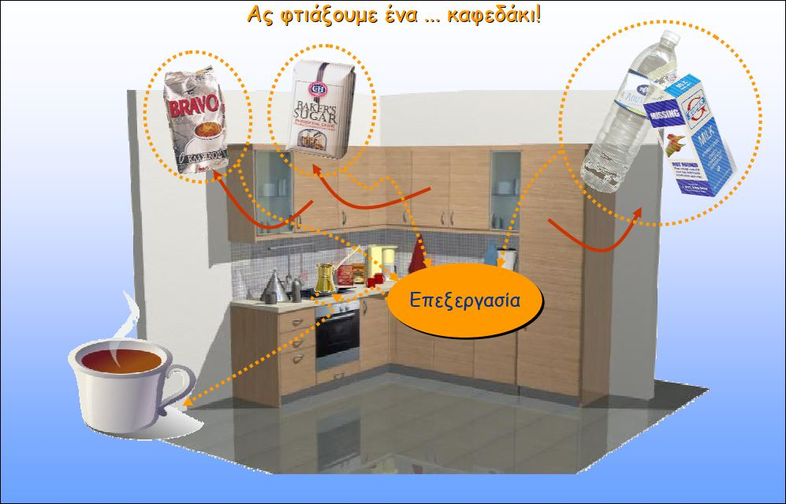

Καλός ο καφές αλλά ...

- Τα δεδοµένα (υλικά) και η επεξεργασία τους είναι εντελώς ασύνδετα µεταξύ τους.
- Τα δεδοµένα (υλικά) είναι εκτεθειµένα και οποιοσδήποτε µπορεί να έχει πρόσβαση σε αυτά.
- Η επεξεργασία δεν είναι αυτοµατοποιηµένη και κάθε φορά µπορεί να είναι διαφορετική (ιδίως αν έχει αλλάξει η θέση των υλικών).
- Σε διαφορετικό περιβάλλον (κουζίνα) η επεξεργασία θα είναι διαφορετική.
- Πρέπει να γνωρίζουµε τον τρόπο επεξεργασίας (π.χ δοσολογία, χρόνο ψησίµατος) για να φτιάξουµε καφέ.
- ∆εν εξασφαλίζουµε πάντα την ίδια ποιότητα αποτελέσµατος (καφέ).

Οπότε τι κάνουμε;

**Η λύση είναι να πάρουμε μια μηχανή για καφέ (καφετιέρα)!**

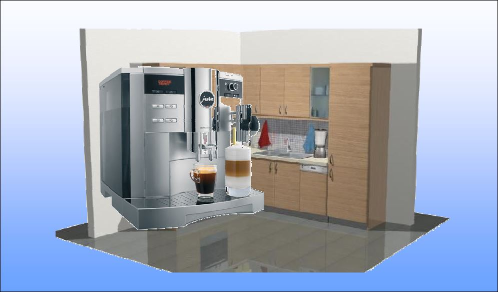

Μας κόστισε λίγο η καφετιέρα αλλά ...

- Τα δεδοµένα (υλικά) και η επεξεργασία τους είναι ενσωµατωµένα σε ένα ενιαίο αντικείµενο: την καφετιέρα.
- Τα δεδοµένα (υλικά) είναι προστατευµένα µέσα στο αντικείµενο (καφετιέρα), χρησιµοποιούνται µόνο από αυτό και δεν µπορεί οποιοσδήποτε να έχει πρόσβαση σε αυτά.
- Η επεξεργασία είναι αυτοµατοποιηµένη και ίδια κάθε φορά.
- Σε διαφορετικό περιβάλλον (κουζίνα) η επεξεργασία (µε ίδιου τύπου καφετιέρα) θα είναι ακριβώς ίδια.
- ∆εν είναι ανάγκη να γνωρίζουµε τον τρόπο επεξεργασίας.
- Εξασφαλίζουµε πάντα την ίδια ποιότητα
αποτελέσµατος (καφέ).

## Διαδραστικός και αντικειμενοστρεφής προγραμματισμός

### Διαδραστικός προγραμματισμός

∆ίνει το βάρος στις διαδικασίες οι οποίες επενεργούν επάνω στα δεδοµένα χωρίς να ασχολείται ιδιαίτερα µε την δοµή και την ασφάλεια των δεδοµένων.

### Αντικειμενοστρεφής προγραμματισμός

∆ίνει το βάρος στα ίδια τα δεδοµένα, τη δοµή τους και την ασφάλειά τους,  µορφοποιώντας αντικείµενα τα οποία περιέχουν τόσο τα δεδοµένα όσο και τις διαδικασίες οι οποίες τα επεξεργάζονται.

## Βασικές έννοιες του Αντικειμενοστρεφούς Προγραμματισμού

- Αντικείμενα (objects)
- Κλάσεις (classes)
- Ενθυλάκωση (encapsulation)
- Αφαιρετικότητα (abstraction)
- Κληρονομικότητα (inheritance)
- Πολυμορφισμός (polymorphism)
- Επαναχρησιμοποίηση (reusability)

## Αντικείμενα και κλάσεις

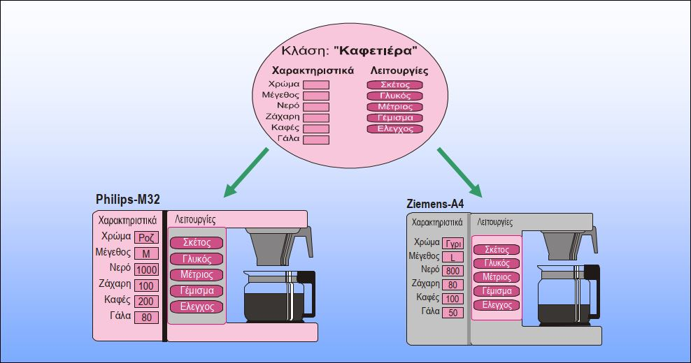

Αντικείμενα με κοινά χαρακτηριστικά και λειτουργίες ανήκουν στην ίδια κλάση!

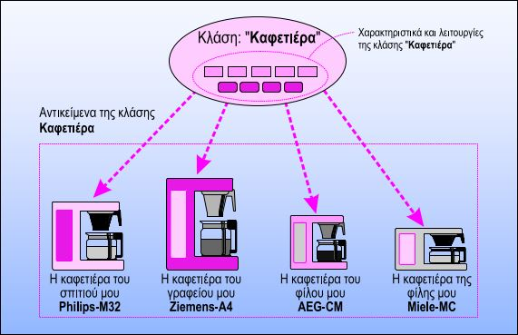

Μια κλάση προσδιορίζει τις "προδιαγραφές" κατασκευής αντικειμένων!

## Κλάσεις (classes)

**Κλάση** (class) είναι µια έννοια η οποία προσδιορίζει µια κατηγορία αντικειµένων και ταυτόχρονα περιγράφει τα κοινά χαρακτηριστικά τους.

- Μια κλάση προσδιορίζει τα χαρακτηριστικά και τις λειτουργίες µιας κατηγορίας αντικειµένων. Π.χ για αυτοκίνητα τα χαρακτηριστικά όπως: Χρώµα, Μάρκα, Κυβισµός και λειτουργίες όπως: εκκίνηση, φρενάρισµα, στροφή.
- Φανταστείτε µια κλάση σαν τις **προδιαγραφές** κατασκευής ενός προϊόντος.
- Η ίδια η κλάση είναι µια **αφηρηµένη έννοια** όπως π.χ δένδρο, αυτοκίνητο κ.λ.π η οποία δεν προσδιορίζει κάποιο συγκεκριµένο αντικείµενο. Μπορεί να έχω κλάσεις χωρίς να έχω αντικείµενα.
- Για παράδειγµα αν καθίσω σήµερα και φτιάξω τις προδιαγραφές κατασκευής για έναν ιπτάµενο δίσκο, θα έχω στα χέρια µου απλώς διάφορα χαρτιά και σχέδια. Θα έχω δηλαδή µια κλάση αλλά κανένα αντικείµενο.
- Μόλις βρω κάποιο εργοστάσιο και φτιάξει τον πρώτο ιπτάµενο δίσκο µε τις προδιαγραφές (κλάση) που θα του δώσω, τότε θα έχω στα χέρια µου ένα χειροπιαστό αντικείµενο αυτής της κλάσης.

## Αντικείμενα (objects) κλάσης

Ένα αντικείµενο (object) µιας κλάσης έχει όλα τα χαρακτηριστικά και τις λειτουργίες της κλάσης στην οποία ανήκει. Ένα αντικείµενο λέµε ότι αποτελεί ένα "στιγµιότυπο" (instance) µιας κλάσης.

- Κάθε αντικείµενο µιας κλάσης διαθέτει τα χαρακτηριστικά της κλάσης µε συγκεκριµένες όµως τιµές. Πχ χρώµα κόκκινο, µάρκα Honda, κυβισµός 1400.
- Κάθε αντικείµενο µιας κλάσης διαθέτει όλες της λειτουργίες της κλάσης. Π.χ κάθε αυτοκίνητο µπορεί να ξεκινήσει, να φρενάρει και να στρίψει!
- Στη καθηµερινή µας ζωή θεωρούµε ένα αντικείµενο όταν είναι κάτι χειροπιαστό. Στον αντικειµενοστρεφή προγραµµατισµό ένα αντικείµενο µπορεί να είναι οτιδήποτε έχει χαρακτηριστικά και λειτουργίες. Π.χ ο λογαριασµός µας σε µια τράπεζα, ένα ραντεβού κ.λπ.

## Ενθυλάκωση και απόκρυψη

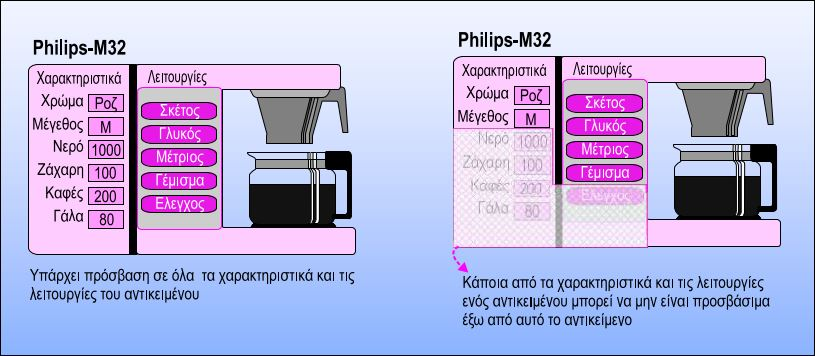

H **ενθυλάκωση** (encapsulation) είναι η δυνατότητα **οµαδοποίησης** χαρακτηριστικών και λειτουργιών σε µια οντότητα (αντικείµενο).

Η **ενθυλάκωση**, δίνει τη δυνατότητα της **απόκρυψης** (information hiding) κάποιων χαρακτηριστικών και λειτουργιών ενός αντικειµένου ώστε να µην είναι άµεσα προσβάσιµα.

- H **απόκρυψη προστατεύει** τα δεδοµένα και τις λειτουργίες ενός αντικειµένου από κακή χρήση.
- H **aπόκρυψη** δηµιουργεί µια **διεπαφή** (interface) του αντικειµένου µόνο µέσω της οποίας µπορεί να χρησιµοποιείται.

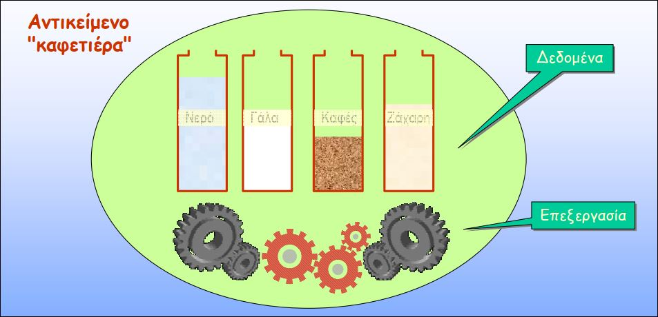

Η ενθυλάκωση, είναι µε απλά λόγια το "πακετάρισµα" δεδοµένων και τρόπου επεξεργασίας τους µέσα σε µια οντότητα!

## Μια άλλη κλάση

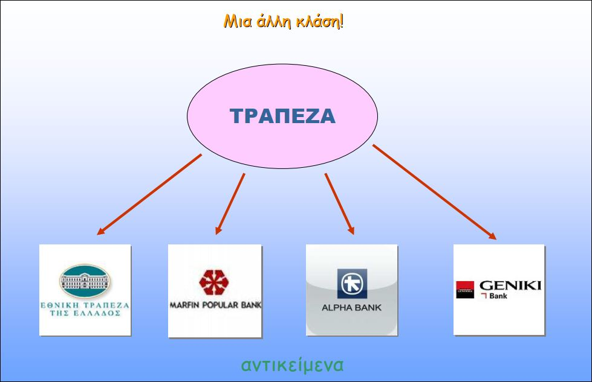

## Διεπαφή αντικειμένου (object interface)

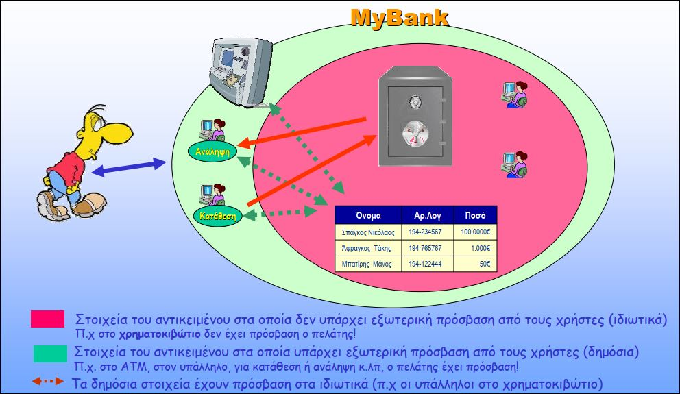

## Η διεπαφή μιας καφετιέρας

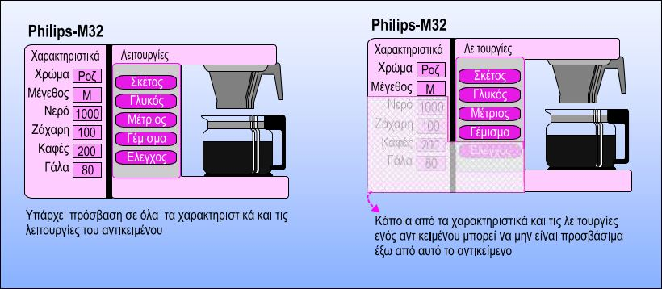

## Διεπαφή αντικειμένου (object interface) καφετιέρας

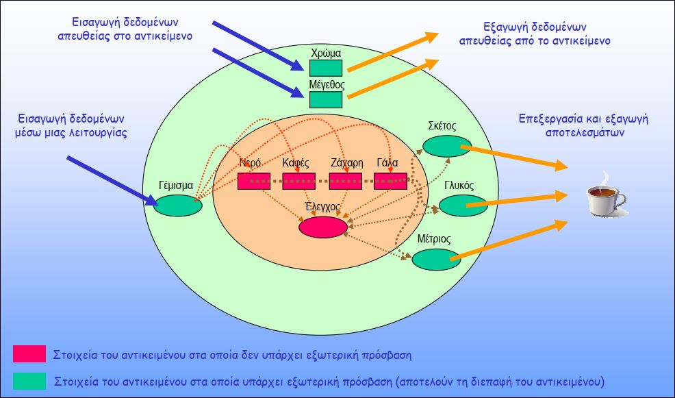

## Αφαιρετικότητα (abstraction)

Το αποτέλεσµα της **ενθυλάκωσης** και της **απόκρυψης** είναι η **αφαιρετικότητα** (abstraction). Η αφαιρετικότητα δίνει τη δυνατότητα της χρήσης ενός αντικειµένου χωρίς να είµαστε αναγκασµένοι να γνωρίζουµε τα λεπτοµερή χαρακτηριστικά του και τις λεπτοµέρειες λειτουργίας του.

- H αφαιρετικότητα µας δίνει τη δυνατότητα να µας απασχολούν µόνο µερικά και όχι όλα τα χαρακτηριστικά ενός αντικειµένου.
- H αφαιρετικότητα µας δίνει τη δυνατότητα να µας απασχολούν µόνο µερικές και όχι όλες οι λειτουργίες ενός αντικειµένου.
- H αφαιρετικότητα µας δίνει τη δυνατότητα να µας απασχολεί µόνο το τι κάνει ένα αντικείµενο και όχι ο τρόπος µε τον οποίον το κάνει!
- Η χρήση ενός αντικειµένου γίνεται µόνο µέσω των χαρακτηριστικών και των λειτουργιών που µας επιτρέπει η διεπαφή του.

## Παραδείγματα αφαιρετικότητας

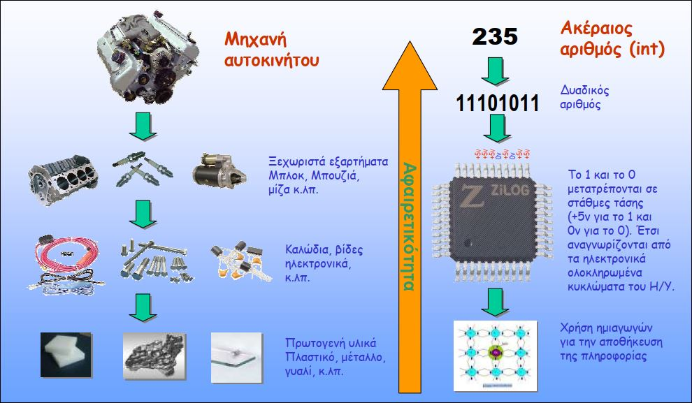

## Κληρονομικότητα (inheritance)

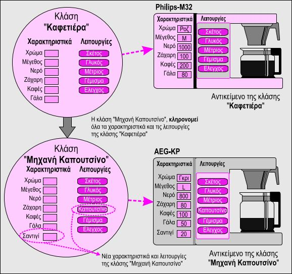

H **κληρονοµικότητα** (inheritance) είναι η δυνατότητα δηµιουργίας µιας νέας κλάσης από µια υπάρχουσα κλάση.

- H νέα κλάση **κληρονοµεί** όλα τα χαρακτηριστικά και τις λειτουργίες της υπάρχουσας κλάσης.
- Στη νέα κλάση µπορούν να **προστεθούν** νέα χαρακτηριστικά και λειτουργίες.
- Χαρακτηριστικά και λειτουργίες της υπάρχουσας κλάσης µπορούν να **αντικατασταθούν** από νέα που ορίζονται στη καινούρια κλάση.
- Στη κληρονοµικότητα υπάρχει περίπτωση να κληρονοµηθεί κάτι χωρίς όµως να υπάρχει πρόσβαση σε αυτό, ή να υπάρχει πρόσβαση υπό όρους!

## Πολυμορφισμός (polymorphism)

Ο **πολυµορφισµός** (polymorphism) είναι η δυνατότητα µιας οντότητας να συµπεριφέρεται µε διαφορετικό τρόπο ανάλογα µε τη χρήση της.

- Πολυµορφισµό έχουµε στη καθηµερινή µας ζωή. Π.χ το ρήµα ανοίγω σηµαίνει διαφορετικά πράγµατα ανάλογα µε τον τρόπο που το χρησιµοποιούµε. Ανοίγω την τηλεόραση, ανοίγω µια κονσέρβα, ανοίγω έναν λογαριασµό στην τράπεζα κ.λ.π
- Ένα χαρακτηριστικό παράδειγµα πολυµορφισµού στον αντικειµενοστρεφή προγραµµατισµό είναι η διαφορετική χρήση των τελεστών. Π.χ τον τελεστή + τον γνωρίζουµε ως τον τελεστή πρόσθεσης και εφαρµόζεται µόνο σε αριθµούς. Μπορούµε να επανορίσουµε την λειτουργία του τελεστή + ώστε αν εφαρµόζεται σε διαφορετικούς τύπους αντικειµένων να εκτελεί διαφορετική λειτουργία.

H υπερφόρτωση τελεστών είναι ένα από τα χαρακτηριστικά του πολυµορφισµού στον αντικειµενοστρεφή προγραµµατισµό.

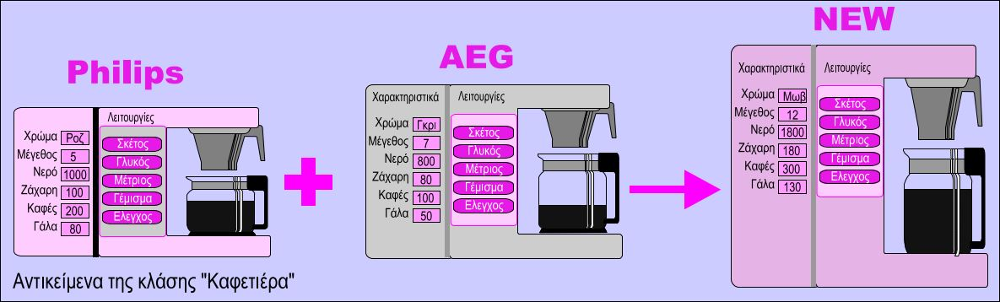

Μπορούµε να επανορίσουµε τη λειτουργία του τελεστή +, ώστε αν προσθέτουµε δύο καφετιέρες να προκύπτει µια νέα µε ενδιάµεσο χρώµα, και µε χωρητικότητες υλικών το άθροισµα των χωρητικοτήτων τους.

## Επαναχρησιμοποίηση (reusability)

Στον αντικειµενοστρεφή προγραµµατισµό **δεν** ανακαλύπτουµε τον τροχό κάθε φορά!

- O **πολυµορφισµός** και η **κληρονοµικότητα** µας δίνουν τη δυνατότητα να χρησιµοποιούµε ξανά και ξανά αντικείµενα που έχουµε δηµιουργήσει είτε εµείς οι ίδιοι είτε άλλοι προγραµµατιστές χωρίς να είµαστε αναγκασµένοι να ξαναγράφουµε κώδικα.
- O **πολυµορφισµός** µας δίνει τη δυνατότητα να γράφουµε κώδικα µια φορά και η γλώσσα να εφαρµόζει σε διαφορετικές περιπτώσεις τη σωστή έκδοσή του. Φανταστείτε µια έξυπνη καφετιέρα στην οποία αν βάλουµε σαντιγί θα συµπεριφέρεται ως µηχανή για καπουτσίνο και αν δεν βάλουµε ως απλή καφετιέρα.
- Η **κληρονοµικότητα** δίνει τη δυνατότητα δηµιουργίας αντικειµένων τα οποία να κληρονοµούν χαρακτηριστικά και λειτουργίες άλλων αντικειµένων. ∆εν χρειάζεται να ασχοληθούµε µε τα χαρακτηριστικά και τις λειτουργίες που κληρονοµήθηκαν παρά µόνο µε τα νέα.
